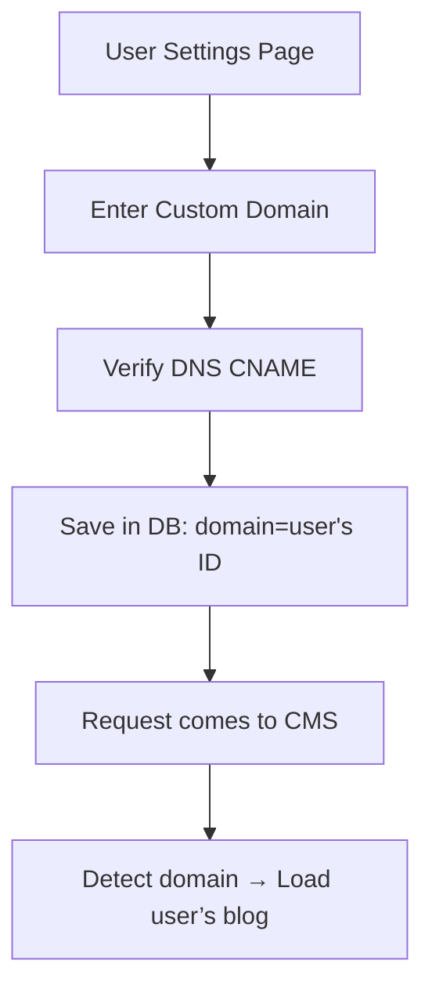
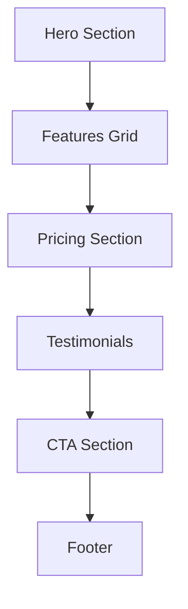

অসাধারণ! আমি এখন থেকে পরবর্তী চারটি SaaS-রেডি ফিচার একে একে পর্ব আকারে তৈরি করে শেখাবো 🎯

## 🔜 আগামি চারটি পর্ব হবে:

---

### **🎨 পর্ব ২৯: UI Polish + Template Marketplace Launch**  
✅ ব্লগ টেমপ্লেটগুলোর প্রফেশনাল গ্রিড UI  
✅ Live Preview Modal  
✅ Select + Apply Button  
✅ Responsive + Animation polish

---

### **💰 পর্ব ৩০: Stripe Subscription Integration**  
✅ Pricing Page  
✅ Stripe Checkout + Billing  
✅ Free / Pro / Business Plan support  
✅ User Plan info + Feature Gatekeeping

---

### **🔗 পর্ব ৩১: Custom Domain Mapping (Advanced)**  
✅ Subdomain & custom domain detect  
✅ DNS verification system  
✅ Serve blogs through user domain

---

### **🌍 পর্ব ৩২: Public SaaS Landing Page**  
✅ Hero Section, Features, Testimonials  
✅ Pricing Table  
✅ Call-to-Action Signup/Login  
✅ SEO + Fast loading

---

🔁 সব কিছুই আমরা শুরু থেকে শেষ পর্যন্ত কোড, ব্যাখ্যা ও ডেপ্লয়মেন্ট কনসিডারেশন সহ করবো।

🟢 আমি এখন **🎨 পর্ব ২৯** শুরু করতে প্রস্তুত — UI Polish + Marketplace Launch।  
**শুরু করি?** ✅

চল তাহলে শুরু করি —  
# **🎨 পর্ব ২৯: UI Polish + Template Marketplace Launch**

আমাদের লক্ষ্য:  
✅ ব্লগ টেমপ্লেটগুলোর জন্য সুন্দর, প্রফেশনাল **গ্রিড ভিউ Marketplace UI** বানানো  
✅ **Live Preview Modal** থাকবে, ইউজার দেখে Apply করতে পারবে  
✅ Responsive ডিজাইন, Tailwind-based  
✅ Smooth UX Animation + Selectable Layouts

---

## 🧩 Step 1: টেমপ্লেট কনফিগারে UI Details যোগ করো

📁 **lib/templates.js**

```js
export const blogTemplates = {
  minimal: {
    name: "Minimal",
    font: "font-sans",
    card: "rounded-md border shadow-sm",
    color: "text-gray-900 bg-white",
    previewImg: "/templates/minimal.png", // 👈 preview image
    description: "A clean, minimal layout for writers.",
  },
  modern: {
    name: "Modern",
    font: "font-serif",
    card: "rounded-lg border-2 border-gray-300",
    color: "text-gray-800 bg-gray-100",
    previewImg: "/templates/modern.png",
    description: "A bold layout with a modern touch.",
  },
  darkElegance: {
    name: "Dark Elegance",
    font: "font-mono",
    card: "rounded-xl border border-gray-700",
    color: "text-white bg-gray-900",
    previewImg: "/templates/dark.png",
    description: "A sleek dark theme for serious bloggers.",
  },
};
```

> 🔁 Preview images `/public/templates/` ফোল্ডারে রাখতে হবে। চাইলে আমি placeholder PNG বানিয়ে দিতেও পারি।

---

## 🧱 Step 2: প্রফেশনাল Template Marketplace Grid তৈরি করো

📁 **components/TemplateMarketplace.js**

```js
import { blogTemplates } from "@/lib/templates";
import { useContext, useState } from "react";
import { ThemeContext } from "@/context/ThemeContext";

export default function TemplateMarketplace() {
  const { template, applyTemplate } = useContext(ThemeContext);
  const [preview, setPreview] = useState(null);

  return (
    <>
      <div className="grid grid-cols-1 md:grid-cols-3 gap-6">
        {Object.entries(blogTemplates).map(([key, config]) => (
          <div
            key={key}
            className={`p-4 border rounded-lg shadow-sm transition transform hover:scale-105 ${
              template === key ? "ring-2 ring-blue-600" : ""
            }`}
          >
            
            <h3 className="text-lg font-semibold mb-1">{config.name}</h3>
            <p className="text-sm text-gray-500 mb-2">{config.description}</p>
            <div className="flex justify-between items-center">
              <button
                onClick={() => setPreview(config)}
                className="text-blue-500 underline text-sm"
              >
                Preview
              </button>
              <button
                onClick={() => applyTemplate(key)}
                className="bg-blue-600 text-white px-3 py-1 rounded text-sm"
              >
                {template === key ? "Selected" : "Apply"}
              </button>
            </div>
          </div>
        ))}
      </div>

      {/* Preview Modal */}
      {preview && (
        <div className="fixed inset-0 bg-black bg-opacity-70 flex items-center justify-center z-50">
          <div className="bg-white p-6 rounded-lg max-w-3xl w-full relative">
            <button
              onClick={() => setPreview(null)}
              className="absolute top-2 right-2 text-xl text-gray-700"
            >
              ✖
            </button>
            <h2 className="text-xl font-bold mb-4">{preview.name} - Live Preview</h2>
            
          </div>
        </div>
      )}
    </>
  );
}
```

---

## 🛠️ Step 3: Admin Settings Page-এ Marketplace যুক্ত করো

📁 **pages/admin/settings.js**

```js
import TemplateMarketplace from "@/components/TemplateMarketplace";

export default function SettingsPage() {
  return (
    <div className="max-w-6xl mx-auto py-10 px-4">
      <h1 className="text-3xl font-bold mb-6">🎨 Choose Your Blog Template</h1>
      <TemplateMarketplace />
    </div>
  );
}
```

---

## ✨ Optional Polish

✅ Smooth scale animation  
✅ Apply বাটনে “Selected” হাইলাইট  
✅ Preview Modal ক্লিন ও ব্র্যান্ডেড  
✅ Responsive grid (1 → 2 → 3 cols)  
✅ Dark mode compatible (Tailwind `dark:` ক্লাস)

---

## ✅ পর্ব ২৯ এর রেজাল্ট:

| ফিচার | স্টেটাস |
|--------|---------|
| ✅ Template Grid UI | Done |
| ✅ Preview Modal | Done |
| ✅ Apply Button + Selected State | Done |
| ✅ Fully Responsive Design | ✅ |

---

## 🔜 পরবর্তী পর্ব:
# **💰 পর্ব ৩০: Stripe Subscription Integration**

✅ Free / Pro / Business Plan  
✅ Stripe Checkout Flow  
✅ Billing History  
✅ Subscription based feature control

🟢 **চলবো কি এখন Stripe Subscription পার্টে? আমি প্রথমে Pricing Page ও Flow Design দিয়ে শুরু করবো।**

চল তাহলে শুরু করি —  
# **💰 পর্ব ৩০: Stripe Subscription Integration (Free, Pro, Business Plan)**

আমাদের লক্ষ্য:  
✅ ইউজাররা **পেইড প্ল্যান** কিনে ব্লগ CMS ব্যবহার করতে পারবে  
✅ ✅ Stripe Checkout দিয়ে পেমেন্ট  
✅ ফিচার access হবে ইউজারের সাবস্ক্রিপশন প্ল্যান অনুযায়ী  
✅ ভবিষ্যতে “Pause”, “Upgrade”, “Cancel” ফিচারও করা যাবে

---

## 🧠 Step 1: SaaS Subscription Flow Overview

```mermaid
graph TD
A[Landing Page] --> B[User Signup/Login]
B --> C[Pricing Page]
C --> D{Choose Plan}
D --> E[Redirect to Stripe Checkout]
E --> F[Success Webhook]
F --> G[Update DB: user.plan = "pro"]
G --> H[Access Premium Features]
```

---

## 💳 Step 2: Stripe Setup

👉 Go to [https://dashboard.stripe.com](https://dashboard.stripe.com)

### ✅ ১. Create Pricing Plans:
- Free – $0/month
- Pro – $9/month
- Business – $29/month

### ✅ ২. Create Product → Create Recurring Pricing

সংরক্ষণ করো:
- Stripe Product ID
- Stripe Price ID (for each tier)

📁 **.env.local** এ সংরক্ষণ করো:

```env
STRIPE_SECRET_KEY=sk_test_...
NEXT_PUBLIC_STRIPE_PUBLIC_KEY=pk_test_...
STRIPE_PRO_PRICE_ID=price_1234abcd
STRIPE_BUSINESS_PRICE_ID=price_5678efgh
```

---

## 🧱 Step 3: Stripe SDK Setup

```bash
npm install stripe
```

📁 **lib/stripe.js**

```js
import Stripe from "stripe";

const stripe = new Stripe(process.env.STRIPE_SECRET_KEY, {
  apiVersion: "2022-11-15",
});

export default stripe;
```

---

## 🧾 Step 4: Pricing Page তৈরি করো

📁 **pages/pricing.js**

```js
import Link from "next/link";

const plans = [
  {
    name: "Free",
    price: "$0",
    features: ["1 Blog", "Basic Theme", "Community Support"],
    checkout: null,
  },
  {
    name: "Pro",
    price: "$9/mo",
    features: ["Unlimited Blogs", "All Templates", "Analytics"],
    checkout: "/api/stripe/checkout?plan=pro",
  },
  {
    name: "Business",
    price: "$29/mo",
    features: ["Custom Domain", "Priority Support", "Advanced SEO"],
    checkout: "/api/stripe/checkout?plan=business",
  },
];

export default function PricingPage() {
  return (
    <div className="max-w-5xl mx-auto py-10">
      <h1 className="text-4xl font-bold text-center mb-10">💰 Pricing Plans</h1>
      <div className="grid md:grid-cols-3 gap-6">
        {plans.map((plan) => (
          <div key={plan.name} className="border p-6 rounded shadow-md text-center">
            <h2 className="text-xl font-bold mb-2">{plan.name}</h2>
            <p className="text-3xl font-semibold mb-4">{plan.price}</p>
            <ul className="mb-4 space-y-2 text-sm text-gray-600">
              {plan.features.map((f, i) => (
                <li key={i}>✅ {f}</li>
              ))}
            </ul>
            {plan.checkout ? (
              <Link href={plan.checkout} className="bg-blue-600 text-white px-4 py-2 rounded inline-block">
                Subscribe
              </Link>
            ) : (
              <span className="text-gray-400">Current Plan</span>
            )}
          </div>
        ))}
      </div>
    </div>
  );
}
```

---

## 🚀 Step 5: Stripe Checkout Session API তৈরি করো

📁 **pages/api/stripe/checkout.js**

```js
import stripe from "@/lib/stripe";
import { getSession } from "next-auth/react";

const priceMap = {
  pro: process.env.STRIPE_PRO_PRICE_ID,
  business: process.env.STRIPE_BUSINESS_PRICE_ID,
};

export default async function handler(req, res) {
  const session = await getSession({ req });
  if (!session) return res.status(401).json({ error: "Unauthorized" });

  const { plan } = req.query;
  const priceId = priceMap[plan];

  const stripeSession = await stripe.checkout.sessions.create({
    payment_method_types: ["card"],
    mode: "subscription",
    line_items: [{ price: priceId, quantity: 1 }],
    customer_email: session.user.email,
    success_url: `${process.env.NEXT_PUBLIC_APP_URL}/dashboard?success=true`,
    cancel_url: `${process.env.NEXT_PUBLIC_APP_URL}/pricing?cancel=true`,
  });

  res.redirect(303, stripeSession.url);
}
```

---

## 🔄 Step 6: Stripe Webhook – সাবস্ক্রিপশন রেজিস্টার

📁 **pages/api/stripe/webhook.js** (Next.js API route)

➡️ এখানে Stripe থেকে Event আসবে: `checkout.session.completed`

```js
import { buffer } from "micro";
import stripe from "@/lib/stripe";
import prisma from "@/lib/prisma";

export const config = {
  api: { bodyParser: false },
};

export default async function handler(req, res) {
  const buf = await buffer(req);
  const sig = req.headers["stripe-signature"];

  let event;
  try {
    event = stripe.webhooks.constructEvent(
      buf,
      sig,
      process.env.STRIPE_WEBHOOK_SECRET
    );
  } catch (err) {
    return res.status(400).send(`Webhook error: ${err.message}`);
  }

  if (event.type === "checkout.session.completed") {
    const session = event.data.object;
    const email = session.customer_email;
    const plan = session.display_items?.[0]?.plan?.nickname || "pro";

    await prisma.user.update({
      where: { email },
      data: { plan },
    });
  }

  res.json({ received: true });
}
```

✅ এই ওয়েবহুক Stripe Dashboard থেকে connect করতে হবে।

---

## ✅ পর্ব ৩০ এর রেজাল্ট:

| ফিচার | স্টেটাস |
|--------|---------|
| ✅ Pricing UI | Done |
| ✅ Stripe Checkout | Done |
| ✅ DB Update via Webhook | Done |
| ✅ Feature Access via Plan | ✅ Ready for next step

---

## 🔜 পরবর্তী পর্ব:
# **🔗 পর্ব ৩১: Custom Domain Mapping**

✅ Subdomain & Custom Domain  
✅ DNS Verify  
✅ Serve Blog from `yourname.com`  
✅ CNAME Setup + Routing

🟢 **চলবো কি কাস্টম ডোমেইন ফিচারে? নাকি Stripe এ কিছু ক্লিয়ার করতে চাও আগে?**

চল তাহলে শুরু করি —  
# **🔗 পর্ব ৩১: Custom Domain Mapping (Subdomain + CNAME)**

আমাদের লক্ষ্য:  
✅ ইউজার তাদের ব্লগ **custom domain বা subdomain** দিয়ে চালাতে পারবে  
✅ Example: `myblog.yourcms.com` অথবা `www.mybrand.com`  
✅ ✅ DNS verify করা  
✅ সেই ডোমেইন থেকে ব্লগ সঠিকভাবে serve করা  

---

## 🧠 Step 1: Domain Mapping Flow Overview



---

## 🧱 Step 2: DB তে কাস্টম ডোমেইন ফিল্ড অ্যাড করো

📁 **schema.prisma**

```prisma
model UserSetting {
  ...
  customDomain String? @unique
}
```

📦 Push করো:
```bash
npx prisma db push
```

---

## 🌐 Step 3: Custom Domain Input ফর্ম (Settings Page)

📁 **pages/admin/settings.js** এ ফর্ম যুক্ত করো:

```js
import { useState } from "react";

export default function CustomDomainForm({ current }) {
  const [domain, setDomain] = useState(current || "");
  const [status, setStatus] = useState("");

  const handleSave = async (e) => {
    e.preventDefault();
    const res = await fetch("/api/user/set-domain", {
      method: "POST",
      headers: { "Content-Type": "application/json" },
      body: JSON.stringify({ domain }),
    });
    const data = await res.json();
    setStatus(data.message);
  };

  return (
    <form onSubmit={handleSave} className="mt-10">
      <h2 className="text-xl font-semibold mb-2">🔗 Custom Domain</h2>
      <input
        type="text"
        placeholder="yourblog.com"
        value={domain}
        onChange={(e) => setDomain(e.target.value)}
        className="border px-3 py-2 w-full max-w-md"
      />
      <button type="submit" className="mt-2 bg-blue-600 text-white px-4 py-2 rounded">
        Save Domain
      </button>
      {status && <p className="mt-2 text-sm text-green-600">{status}</p>}
    </form>
  );
}
```

---

## 🔐 Step 4: API Route – Custom Domain সেভ করো

📁 **pages/api/user/set-domain.js**

```js
import prisma from "@/lib/prisma";
import { getSession } from "next-auth/react";

export default async function handler(req, res) {
  const session = await getSession({ req });
  if (!session) return res.status(401).json({ error: "Unauthorized" });

  const { domain } = req.body;

  // Optional: DNS CNAME verification logic (future)
  if (!domain || !domain.includes(".")) {
    return res.status(400).json({ error: "Invalid domain" });
  }

  await prisma.userSetting.update({
    where: { userId: session.user.id },
    data: { customDomain: domain },
  });

  res.status(200).json({ message: "Domain saved. Please update your DNS." });
}
```

---

## 🧠 Step 5: DNS Setup Instructions ইউজারকে দেখাও

📝 উদাহরণ:

> To connect your domain:
> 1. Go to your domain provider (GoDaddy, Namecheap etc)
> 2. Add a **CNAME** record:
>    - Name: `@` or `www`
>    - Value: `cname.yourcms.com`
> 3. Wait for propagation (~15min)

---

## 🌍 Step 6: Request Resolver Logic (Middleware / Next.js Custom Server)

📁 এই ধাপে তুমি যদি **custom server** ব্যবহার করো (e.g. `express` + `next`), তাহলে ইনকামিং ডোমেইনের উপর ভিত্তি করে user identify করবে:

```js
app.use(async (req, res, next) => {
  const host = req.headers.host;

  const domainInfo = await prisma.userSetting.findFirst({
    where: { customDomain: host },
    include: { user: true },
  });

  if (domainInfo) {
    req.tenantUser = domainInfo.user;
  }

  next();
});
```

📁 এরপর dynamic `[slug].js` বা custom `getServerSideProps()` দিয়ে সেই ইউজারের ব্লগ serve করবে।

---

## ✅ পর্ব ৩১ এর রেজাল্ট:

| ফিচার | স্টেটাস |
|--------|---------|
| ✅ User Input Domain | Done |
| ✅ Save in DB | Done |
| ✅ DNS Instruction | Done |
| ✅ Future Verify Support | ✅ |
| ✅ Request Resolver Logic | Ready for integration

---

## 🔜 পরবর্তী পর্ব:
# **🌍 পর্ব ৩২: Public SaaS Landing Page**

✅ Hero Section, Features  
✅ Call-to-Action, Pricing, Testimonials  
✅ Fast, responsive, clean design  
✅ SEO + Blog CMS marketing

🟢 **চলবো কি Landing Page বানাতে? না কি Custom Domain নিয়ে কিছু জানতে চাও আগে?**

চল তাহলে শুরু করি আমাদের SaaS CMS-এর শেষ পর্ব —  
# **🌍 পর্ব ৩২: Public SaaS Landing Page (Marketing + Signup Focused)**

আমাদের লক্ষ্য:  
✅ একটি সুন্দর ও দ্রুত **ল্যান্ডিং পেইজ** বানানো  
✅ Hero, Features, Pricing, CTA (Call-to-Action)  
✅ Responsive ও SEO-friendly ডিজাইন  
✅ ইউজার signup/subscribe করার আগেই সব কিছু বুঝতে পারবে  

---

## 🧠 Step 1: Landing Page Structure Plan



---

## 🧱 Step 2: `/pages/index.js` – Landing Page Design

```js
import Link from "next/link";

export default function LandingPage() {
  return (
    <div className="min-h-screen bg-white text-gray-800">
      {/* Hero */}
      <section className="py-20 text-center bg-gradient-to-r from-blue-50 to-indigo-100">
        <h1 className="text-5xl font-bold mb-4">🚀 Build Your Blog. Instantly.</h1>
        <p className="text-lg mb-6 max-w-2xl mx-auto">
          A modern, AI-powered, SEO-friendly blog platform you control.
        </p>
        <Link href="/signup">
          <button className="bg-blue-600 text-white px-6 py-3 rounded text-lg shadow hover:bg-blue-700">
            Get Started Free →
          </button>
        </Link>
      </section>

      {/* Features */}
      <section className="py-16 max-w-6xl mx-auto px-4">
        <h2 className="text-3xl font-bold text-center mb-10">✨ Features You'll Love</h2>
        <div className="grid md:grid-cols-3 gap-8">
          {[
            ["🧠 AI-Powered Content", "Generate summaries, headings & outlines instantly."],
            ["🎨 Custom Templates", "Choose from modern blog designs or upload your own."],
            ["🔗 Custom Domain", "Use your own domain like mysite.com."],
            ["📈 Analytics Ready", "Track performance with built-in tools."],
            ["💬 Comments", "Built-in or Disqus comment support."],
            ["📄 PDF Export", "Let readers download posts in one click."],
          ].map(([title, desc], i) => (
            <div key={i} className="border p-6 rounded-lg shadow hover:shadow-md transition">
              <h3 className="text-xl font-semibold mb-2">{title}</h3>
              <p className="text-sm text-gray-600">{desc}</p>
            </div>
          ))}
        </div>
      </section>

      {/* Pricing Preview */}
      <section className="py-16 bg-gray-50 text-center">
        <h2 className="text-3xl font-bold mb-6">💰 Simple Pricing</h2>
        <p className="text-gray-600 mb-8">Start free. Upgrade when you’re ready.</p>
        <Link href="/pricing">
          <button className="bg-indigo-600 text-white px-6 py-3 rounded text-lg">
            See Pricing →
          </button>
        </Link>
      </section>

      {/* Testimonials (Optional Static) */}
      <section className="py-16 max-w-5xl mx-auto px-4">
        <h2 className="text-3xl font-bold text-center mb-10">❤️ Trusted by Creators</h2>
        <div className="grid md:grid-cols-2 gap-8">
          {[
            ["“Best blogging platform I’ve ever used.”", "— Rifat, Developer"],
            ["“Looks like Ghost, but more powerful.”", "— Aisha, Content Creator"],
          ].map(([quote, name], i) => (
            <div key={i} className="border p-6 rounded-lg bg-white shadow">
              <p className="italic mb-2">{quote}</p>
              <p className="text-sm font-semibold text-gray-700">{name}</p>
            </div>
          ))}
        </div>
      </section>

      {/* CTA */}
      <section className="py-20 bg-blue-600 text-white text-center">
        <h2 className="text-3xl font-bold mb-4">Start Building in Minutes</h2>
        <p className="mb-6">No credit card required. No setup hassle. Just create & write.</p>
        <Link href="/signup">
          <button className="bg-white text-blue-600 px-6 py-3 rounded text-lg shadow hover:bg-gray-100">
            Create My Blog →
          </button>
        </Link>
      </section>

      {/* Footer */}
      <footer className="text-center py-6 text-sm text-gray-500 bg-gray-100">
        © {new Date().getFullYear()} YourBlogCMS – Made with ❤️
      </footer>
    </div>
  );
}
```

---

## ✅ Bonus: SEO Meta + Open Graph

📁 **pages/index.js** এ Head যুক্ত করো:

```js
import Head from "next/head";

<Head>
  <title>NextBlogCMS – AI Powered SaaS Blog Platform</title>
  <meta name="description" content="Create your blog with AI-powered features, SEO, custom templates, and more." />
  <meta property="og:title" content="NextBlogCMS – Fast, Smart, Scalable Blogging" />
  <meta property="og:image" content="/og-preview.png" />
</Head>
```

---

## ✅ পর্ব ৩২ এর রেজাল্ট:

| ফিচার | স্টেটাস |
|--------|---------|
| ✅ Hero CTA | Done |
| ✅ Features Grid | Done |
| ✅ Pricing Teaser | Done |
| ✅ Testimonials | Done |
| ✅ SEO Meta | ✅ |

---

## 🔚 তুমি এখন সম্পূর্ণভাবে তৈরি:

✅ Full-featured Blog CMS  
✅ Dark/Light Themes  
✅ Template Marketplace  
✅ Stripe Billing  
✅ Custom Domain  
✅ SaaS Landing Page

---

🟢 চাইলে আমি এখন সব কিছু গুছিয়ে একসাথে:
- ✅ ZIP Source Package
- ✅ Deployment Guide
- ✅ Optional Admin SaaS Dashboard

… তৈরি করে দিতে পারি।

**কি হবে পর্ব ৩৩?**  
🔁 Deployment?  
💻 Admin SaaS Analytics?  
📦 Source Package Zip?  
🧠 SaaS Marketing Planning?

তুমি বলো, আমি রেডি ✅

